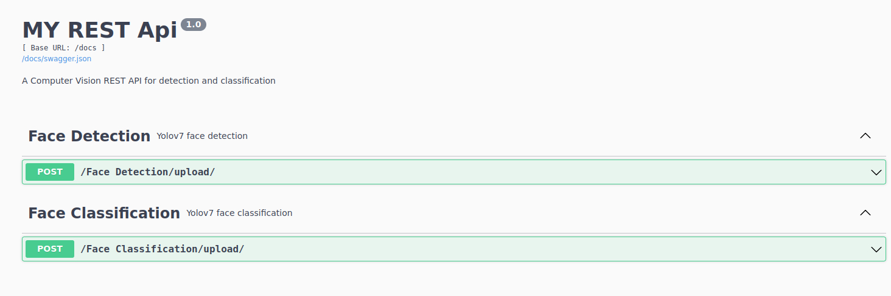

# Create a Computer Vision Model Prediction REST API service with Swagger UI using Flask, Flask-RESTX

* Create a virtual environment and activate the same.
* Install the necessary packages using `pip install -r requirements.txt` command
* Create folder `apis` which will hold the code for endpoint urls and views. Create another folder `models` to hold the model binaries used for the inference. Make sure to add this folder to the .gitignore list before committing the code to GitHub.
* Within `apis` folder create subfolders based on the task and create modules based on the subtasks e.g., `detection` is a task and `face detection` is a subtask.
* The modules will have the namespaces for e.g., face_detect and api resources defined using the `Namespace` and `Resource` classes of the `flask_restx` package. Make sure to import the namespaces in the `__init__.py` file within the subfolders in `apis` folder.
* In `__init__.py` file of the `apis` folder, create the api object using the `flask_restx` packages `Api` class. Also create the blueprint object (a collection of routes and other app-related functions that can be registered on a real application later) using the `Blueprint` class of the `flask` library.
* Add the namespaces to the api object created above.
* Within the `app.py`, create a `Flask` object usually called as the `app`. Import the blueprint object from the `apis` module and register the blueprint object to the app object.

